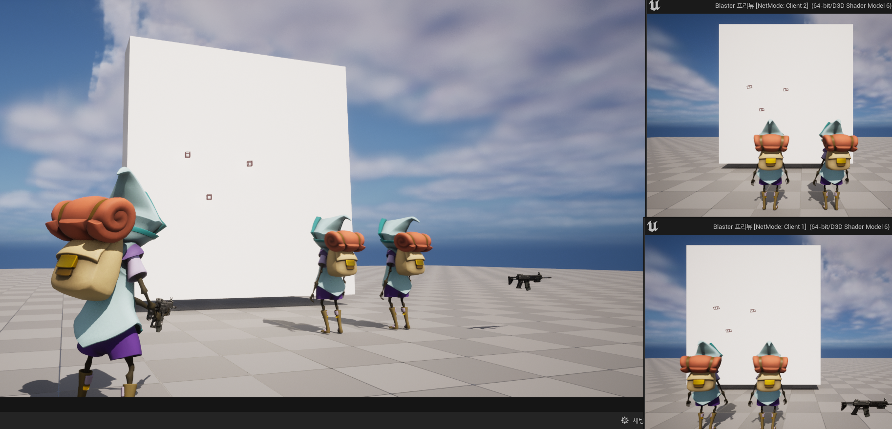

# Unreal5.1_BlasterGame

* C++를 사용하여 Unreal Engine5에서 진행되는 멀티플레이어 슈팅 게임 제작
* [언리얼 엔진 5 C++ 멀티플레이어 슈팅 게임 (출처: Udemy)](https://www.udemy.com/course/unreal-engine-5-cpp-multiplayer-shooter/?couponCode=LEADERSALE24A)

## 1. Projectile testing in multi-environment

